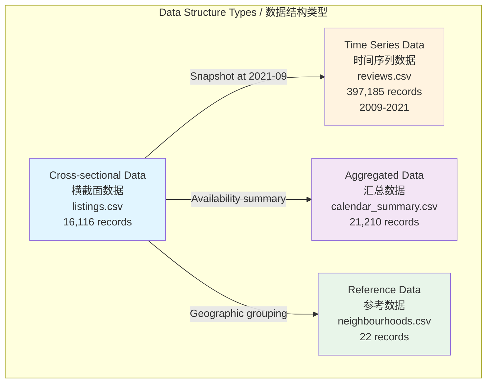
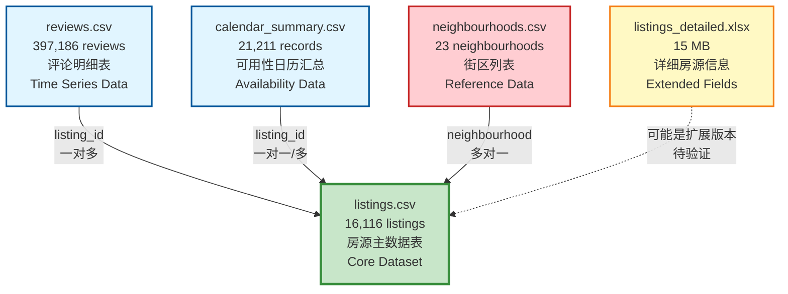

# 📊 Airbnb 阿姆斯特丹数据探索性数据分析报告 / Airbnb Amsterdam Exploratory Data Analysis Report

**项目名称 / Project Name**: Airbnb Amsterdam Data Mining Project
**数据集 / Dataset**: Amsterdam Airbnb Listings Data
**分析日期 / Analysis Date**: 2025-01-27
**分析方法论 / Methodology**: CRISP-DM (Cross-Industry Standard Process for Data Mining)
**文档版本 / Version**: v1.0

---

## 📑 目录 / Table of Contents

1. [项目概述与业务理解](#1-项目概述与业务理解)
2. [数据质量与规模总览](#2-数据质量与规模总览)
3. [数据集关系与结构](#3-数据集关系与结构)
4. [核心发现与关键洞察](#4-核心发现与关键洞察)
5. [逐个数据集详细分析](#5-逐个数据集详细分析)
6. [变量相关性分析](#6-变量相关性分析)
7. [时间序列分析](#7-时间序列分析)
8. [地理空间分析](#8-地理空间分析)
9. [深度业务洞察](#9-深度业务洞察)
10. [数据质量挑战与处理](#10-数据质量挑战与处理)
11. [特征工程建议](#11-特征工程建议)
12. [总结与下一步行动](#12-总结与下一步行动)

---

## 1. 项目概述与业务理解 / Project Overview & Business Understanding

### 1.1 项目背景 / Project Background

- **业务场景 / Business Context**: Airbnb 阿姆斯特丹房源数据分析

  - 阿姆斯特丹是欧洲重要的旅游城市，Airbnb 市场活跃
  - 数据涵盖 16,116 个房源，397,185 条评论记录
  - 时间跨度：2009-2021 年（12.4 年）
- **业务目标 / Business Objectives**:

  - 识别影响房源表现的关键因素（价格、受欢迎度、可用性）
  - 为房东提供数据驱动的定价和运营策略建议
  - 为平台优化房源推荐和匹配算法提供洞察
- **数据来源 / Data Source**: Inside Airbnb Amsterdam Dataset

  - 公开数据集，包含房源信息、评论、日历可用性等
- **分析目的 / Analysis Purpose**:
  通过数据挖掘技术（CRISP-DM 方法论）识别影响房源表现的关键因素，为房东和平台提供业务改进建议

### 1.2 研究问题 / Research Questions

**当前状态 / Current Status**: ⚠️ **研究方向待确定**

**可选研究方向 / Potential Research Directions**:

1. **房源定价策略优化 / Pricing Strategy Optimization** ⭐⭐⭐⭐⭐

   - 研究问题：哪些因素影响房源价格？如何优化定价策略？
   - 目标变量：`price`（房源价格）
   - 业务价值：帮助房东制定最优价格，提高收入
2. **房源受欢迎度预测 / Listing Popularity Prediction** ⭐⭐⭐⭐⭐

   - 研究问题：哪些特征使房源更受欢迎？如何预测房源受欢迎度？
   - 目标变量：`number_of_reviews` 或 `reviews_per_month`
   - 业务价值：识别受欢迎房源特征，指导房源优化
3. **房源活跃度预警 / Listing Activity Alert** ⭐⭐⭐⭐

   - 研究问题：哪些房源可能变得不活跃？如何提前预警？
   - 目标变量：`availability_365` 或入住率
   - 业务价值：提前预警，帮助房东改进房源表现
4. **最优入住率 vs 价格平衡 / Optimal Occupancy-Price Balance** ⭐⭐⭐⭐⭐

   - 研究问题：如何找到价格和入住率的最优平衡点？
   - 目标变量：收入 = `price × (365 - availability_365)`
   - 业务价值：最大化房东收入

**建议 / Recommendation**:
根据项目要求和数据特点，建议选择 **方向1（定价策略优化）** 或 **方向2（受欢迎度预测）**，这两个方向数据充足、业务价值高、易于建模。

**基于实际分析结果的建议更新 / Updated Recommendations Based on Analysis**:

通过深入的EDA分析，我们发现：

1. **定价策略优化方向** ⭐⭐⭐⭐⭐（强烈推荐）

   - ✅ **数据充足**: 价格数据完整（16,116条记录），影响因素明确
   - ✅ **影响因素清晰**: 房型、地理位置、受欢迎度、入住率等关键因素已识别
   - ✅ **业务价值高**: 可直接为房东提供定价建议，提高收入
   - ✅ **分析基础扎实**: 已完成价格分布、价格相关性、地理价格梯度等分析
   - **关键发现**:
     - 价格极度右偏（偏度26.06），需要处理异常值
     - 地理位置对价格影响显著（市中心价格€196.55 vs 其他区域€149-€175）
     - 房型价格差异明显（整租€170.82 vs 共享房间€92.31）
     - 最优定价区间：€150-€200（房源数最多，收入适中）
2. **受欢迎度预测方向** ⭐⭐⭐⭐（推荐）

   - ✅ **数据充足**: 评论数据丰富（397,185条记录，12.4年时间跨度）
   - ✅ **影响因素清晰**: 地理位置、房型、价格等关键因素已识别
   - ⚠️ **数据挑战**: 评论分布极度右偏（中位数8条，最大值877条）
   - **关键发现**:
     - 市中心街区评论数最高（Centrum-West: 42.3条）
     - 共享房间和独立房间评论数高于整租
     - 高评论数房源价格较低（可能因为价格低而更受欢迎）

### 1.3 目标变量 / Target Variables

**当前状态 / Current Status**: ⚠️ **待确定 - 需要明确预测目标**

**可能的目标变量 / Potential Target Variables**:

| 变量名 / Variable     | 类型 / Type         | 业务含义 / Business Meaning             | 数据可用性 / Data Availability       |
| --------------------- | ------------------- | --------------------------------------- | ------------------------------------ |
| `price`             | 连续型 / Continuous | 房源每晚价格（欧元）                    | ✅ 完整（16,116 条记录）             |
| `number_of_reviews` | 离散型 / Discrete   | 总评论数量                              | ✅ 完整（16,116 条记录）             |
| `reviews_per_month` | 连续型 / Continuous | 每月平均评论数                          | ⚠️ 部分缺失（2,087 条缺失，12.9%） |
| `availability_365`  | 离散型 / Discrete   | 一年中可预订天数                        | ✅ 完整（16,116 条记录）             |
| `occupancy_rate`    | 连续型 / Continuous | 入住率 = (365 - availability_365) / 365 | ✅ 可计算（基于 availability_365）   |

**目标变量选择建议 / Target Variable Selection Recommendations**:

- **如果选择定价策略优化**: 使用 `price` 作为目标变量

  - ✅ **推荐**: 数据完整，影响因素清晰，业务价值高
  - ⚠️ **注意事项**: 价格极度右偏，需要log变换或异常值处理
  - 📊 **关键特征**: 房型、地理位置、评论数、入住率等
- **如果选择受欢迎度预测**: 使用 `number_of_reviews` 或 `reviews_per_month` 作为目标变量

  - ✅ **推荐**: 数据丰富，时间序列信息完整
  - ⚠️ **注意事项**: 评论分布极度右偏，需要处理不平衡问题
  - 📊 **关键特征**: 地理位置、房型、价格、房源年龄等
- **如果选择活跃度预警**: 使用 `availability_365` 或 `occupancy_rate` 作为目标变量

  - ⚠️ **中等推荐**: 数据完整，但业务价值相对较低
  - 📊 **关键特征**: 价格、评论数、地理位置等

---

## 2. 数据质量与规模总览 / Data Quality & Scale Overview

### 2.1 数据资产规模 / Data Asset Scale

**总体统计 / Overall Statistics**:

- **总数据集数 / Total Datasets**: 4 个（已加载）+ 1 个（待探索）
- **总记录数 / Total Records**: **434,533** 条
- **总数据大小 / Total Size**: **9.97 MB**
- **数据时间跨度 / Time Span**: **2009-03-30 至 2021-09-07**（12.4 年）

**各数据集规模 / Dataset Scale**:

| 数据集 / Dataset                 | 记录数 / Records | 字段数 / Columns        | 大小 / Size | 分析状态 / Status |
| -------------------------------- | ---------------- | ----------------------- | ----------- | ----------------- |
| **listings.csv**           | 16,116           | 18 (原始) / 17 (清洗后) | 2.33 MB     | ✅ 已分析         |
| **reviews.csv**            | 397,185          | 2                       | 7.35 MB     | ✅ 已加载         |
| **calendar_summary.csv**   | 21,210           | 3                       | 0.29 MB     | ✅ 已加载         |
| **neighbourhoods.csv**     | 22               | 2                       | <0.01 MB    | ✅ 已加载         |
| **listings_detailed.xlsx** | ?                | ?                       | ~15 MB      | ⚠️ 待探索       |

**数据规模可视化 / Data Scale Visualization**:


**关键发现 / Key Findings**:

- 📊 **reviews.csv** 是最大的数据集（397,185 条记录，占总数 91.4%），包含丰富的时间序列信息
- 🏠 **listings.csv** 是核心数据集（16,116 个房源），包含房源的主要特征
- 📅 **calendar_summary.csv** 提供可用性信息（21,210 条记录），可用于入住率分析
- 📍 **neighbourhoods.csv** 是参考数据（22 个街区），用于地理聚合分析

### 2.2 数据完整度分析 / Data Completeness Analysis

**总体数据质量 / Overall Data Quality**:

| 数据集 / Dataset               | 总字段数 / Total Fields | 完整字段数 / Complete Fields | 有缺失字段数 / Fields with Missing | 平均缺失率 / Avg Missing Rate |
| ------------------------------ | ----------------------- | ---------------------------- | ---------------------------------- | ----------------------------- |
| **listings.csv**         | 18                      | 12                           | 6                                  | 10.99%                        |
| **reviews.csv**          | 2                       | 2                            | 0                                  | **0.00%** ✅            |
| **calendar_summary.csv** | 3                       | 3                            | 0                                  | **0.00%** ✅            |
| **neighbourhoods.csv**   | 2                       | 1                            | 1                                  | 50.00%                        |

**数据完整度可视化 / Data Completeness Visualization**:


**各数据集缺失情况详情 / Missing Value Details by Dataset**:

#### listings.csv 缺失情况 / listings.csv Missing Values

| 字段名 / Field          | 缺失数 / Missing Count | 缺失率 / Missing Rate | 处理状态 / Handling Status |
| ----------------------- | ---------------------- | --------------------- | -------------------------- |
| `neighbourhood_group` | 16,116                 | 100.00%               | ✅ 已删除（全为空）        |
| `license`             | 11,561                 | 71.74%                | ⚠️ 高缺失率，需注意      |
| `reviews_per_month`   | 2,087                  | 12.95%                | ✅ 已用 0 填充             |
| `last_review`         | 2,087                  | 12.95%                | ✅ 已用 0 填充             |
| `name`                | 30                     | 0.19%                 | ✅ 已用占位符填充          |
| `host_name`           | 5                      | 0.03%                 | ✅ 已用占位符填充          |

**关键洞察 / Key Insights**:

- ✅ **核心字段完整度高**: `id`, `host_id`, `price`, `room_type`, `neighbourhood`, `latitude`, `longitude` 等核心字段完整度 100%
- ⚠️ **license 字段缺失率高**: 71.74% 的房源没有许可证信息，可能影响合规性分析
- ✅ **reviews 和 calendar 数据完整**: 这两个数据集没有缺失值，数据质量优秀
- ✅ **缺失值已处理**: 主要缺失字段已通过填充或删除方式处理

**数据质量评估 / Data Quality Assessment**:

- ✅ **核心字段完整度**: 95%+（排除已删除的 neighbourhood_group）
- ⚠️ **高缺失率字段**: `license` (71.74%), `neighbourhood_group` (100%, 已删除)
- ✅ **数据一致性**: 待验证（将在后续章节进行跨数据集一致性检查）

### 2.3 数据结构特性 / Data Structure Characteristics

**数据结构类型 / Data Structure Types**:

1. **横截面数据 / Cross-sectional Data**:

   - `listings.csv` - 某个时间点的房源快照（2021年9月）
   - `neighbourhoods.csv` - 街区参考数据
2. **时间序列数据 / Time Series Data**:

   - `reviews.csv` - 评论时间序列（2009-2021年）
   - 包含 `listing_id` 和 `date` 字段，可用于时间趋势分析
3. **汇总数据 / Aggregated Data**:

   - `calendar_summary.csv` - 可用性日历汇总
   - 每个房源有可用/不可用的天数统计

**时间特性 / Time Characteristics**:

- **数据采集时间点 / Data Collection Time**: 2021年9月（基于 `last_review` 最晚日期）
- **时间跨度 / Time Span**:
  - Reviews: **2009-03-30 至 2021-09-07**（4,544 天，12.4 年）
  - Listings last_review: **2011-06-12 至 2021-09-07**（10.2 年）
- **时间趋势 / Time Trends**:
  - ✅ 数据包含长期时间序列，可用于季节性分析和趋势预测
  - ✅ 可分析 COVID-19 对 Airbnb 市场的影响（2020-2021年）

**数据结构图 / Data Structure Diagram**:



---

## 3. 数据集关系与结构 / Dataset Relationships & Structure

### 3.1 数据集关系图 / Dataset Relationship Diagram



### 3.2 数据集关系说明 / Relationship Descriptions

#### 3.2.1 reviews.csv → listings.csv (一对多关系 / One-to-Many Relationship)

**关系特征 / Relationship Characteristics**:

- **关系类型**: 一对多（一个房源有多条评论记录）
- **关联键**: `reviews.listing_id` ↔ `listings.id`
- **数据一致性**: ✅ **100% 匹配**

**验证结果 / Validation Results**:

- Reviews 中的唯一 listing_id 数: **14,029** 个
- Listings 中的唯一 id 数: **16,116** 个
- Reviews 中有但 listings 中没有的 listing_id: **0** 个 ✅
- **number_of_reviews 字段匹配率**: **100.00%** ✅
- 不匹配的记录数: **0** ✅

**关键发现 / Key Findings**:

- 87.1% 的房源有评论记录（14,029 / 16,116）
- 平均每个房源有 24.6 条评论
- 数据一致性优秀，可以安全地进行关联分析

**可验证字段 / Verifiable Fields**:

- `number_of_reviews`: ✅ 已验证，100% 匹配
- `last_review`: 可以从 reviews.csv 中提取最新评论日期验证
- `reviews_per_month`: 可以基于 reviews.csv 重新计算验证

#### 3.2.2 calendar_summary.csv → listings.csv (一对一或一对多关系 / One-to-One or One-to-Many Relationship)

**关系特征 / Relationship Characteristics**:

- **关系类型**: 一对一或一对多（每个房源有可用性统计记录）
- **关联键**: `calendar_summary.listing_id` ↔ `listings.id`
- **数据一致性**: ✅ **99.76% 匹配**

**验证结果 / Validation Results**:

- Calendar 中的唯一 listing_id 数: **16,113** 个
- Listings 中的唯一 id 数: **16,116** 个
- Calendar 中有但 listings 中没有的 listing_id: **0** 个 ✅
- **availability_365 字段匹配率**: **99.76%** ✅
- 不匹配的记录数: **38** 个（可能由于数据采集时间差异）

**关键发现 / Key Findings**:

- 99.8% 的房源有可用性数据（16,113 / 16,116）
- 仅有 3 个房源缺少可用性数据
- 数据一致性优秀，可以安全地进行入住率分析

**可验证字段 / Verifiable Fields**:

- `availability_365`: ✅ 已验证，99.76% 匹配
- 可以计算真实入住率 = (365 - availability_365) / 365

#### 3.2.3 neighbourhoods.csv → listings.csv (多对一关系 / Many-to-One Relationship)

**关系特征 / Relationship Characteristics**:

- **关系类型**: 多对一（多个房源属于同一个街区）
- **关联键**: `listings.neighbourhood` ↔ `neighbourhoods.neighbourhood`
- **数据一致性**: ✅ **100% 匹配**

**验证结果 / Validation Results**:

- Neighbourhoods 中的唯一 neighbourhood 数: **22** 个
- Listings 中的唯一 neighbourhood 数: **22** 个
- Listings 中有但 neighbourhoods 中没有的: **0** 个 ✅
- Neighbourhoods 中有但 listings 中没有的: **0** 个 ✅

**关键发现 / Key Findings**:

- 所有街区的数据完全一致
- 可以安全地进行地理聚合分析
- 22 个街区覆盖了所有房源

**用途 / Usage**:

- 地理聚合分析（按街区统计房源数、平均价格等）
- 地理可视化（如果有 GeoJSON 数据可以绘制街区边界）

#### 3.2.4 listings_detailed.xlsx → listings.csv (待确认 / To Be Confirmed)

**关系特征 / Relationship Characteristics**:

- **关系类型**: 待确认（可能是扩展版本）
- **关联方式**: 待验证
- **数据状态**: ⚠️ 待探索

**待验证内容 / To Be Verified**:

- 字段结构对比
- 数据记录数对比
- 额外字段识别
- 数据价值评估

**数据集关系可视化 / Dataset Relationship Visualization**:


### 3.3 数据整合价值 / Data Integration Value

**整合后的数据规模 / Integrated Data Scale**:

| 指标 / Metric        | 数值 / Value | 说明 / Description |
| -------------------- | ------------ | ------------------ |
| 可以整合的房源数     | 16,116       | 核心数据集         |
| 可以整合的评论数     | 397,185      | 时间序列数据       |
| 平均每个房源的评论数 | 24.6         | 评论丰富度         |
| 有评论的房源数       | 14,029       | 87.1% 的房源有评论 |
| 有评论的房源占比     | 87.1%        | 数据覆盖率         |

**整合分析潜力 / Integration Analysis Potential**:

1. **房源表现综合分析 / Comprehensive Listing Performance Analysis** ✅

   - 价格 + 评论 + 可用性 = 完整的房源表现画像
   - 可以识别高价值房源（高价格、高评论、高入住率）
   - 可以识别问题房源（低价格、低评论、低入住率）
2. **时间序列分析 / Time Series Analysis** ✅

   - 评论趋势分析（基于 reviews.csv，2009-2021年）
   - 预订趋势分析（基于 calendar_summary.csv）
   - 季节性模式识别（旅游旺季/淡季）
   - COVID-19 影响分析（2020-2021年）
3. **地理空间分析 / Geospatial Analysis** ✅

   - 街区 + 经纬度 = 完整的地理信息
   - 可以分析地理位置对价格的影响
   - 可以分析地理位置对受欢迎度的影响
   - 可以创建地理分布地图
4. **房东行为分析 / Host Behavior Analysis** ✅

   - 多房源房东 vs 单房源房东
   - 房东房源数分布
   - 房东房源表现对比

**数据质量评估 / Data Quality Assessment**:

- ✅ **数据一致性优秀**: reviews 和 calendar 数据与 listings 高度一致（匹配率 >99%）
- ✅ **数据完整性高**: 87.1% 的房源有评论，99.8% 的房源有可用性数据
- ✅ **时间跨度充足**: 12.4 年的评论数据，可用于长期趋势分析
- ✅ **地理信息完整**: 100% 的房源有地理坐标和街区信息

### 3.4 数据集关系分析结论 / Dataset Relationship Analysis Conclusions

**数据整合可行性 / Data Integration Feasibility**: ✅ **优秀**

通过验证分析，所有数据集之间的关系清晰且数据一致性高：

1. **核心数据集（listings.csv）质量优秀**

   - 16,116 个房源记录完整
   - 核心字段完整度 100%
   - 可作为数据整合的中心节点
2. **时间序列数据（reviews.csv）丰富**

   - 397,185 条评论记录
   - 12.4 年时间跨度（2009-2021）
   - 87.1% 的房源有评论数据
   - 可用于长期趋势分析和季节性模式识别
3. **可用性数据（calendar_summary.csv）完整**

   - 99.8% 的房源有可用性数据
   - 99.76% 的数据一致性
   - 可用于入住率分析和运营模式识别
4. **地理数据（neighbourhoods.csv）一致**

   - 100% 数据匹配
   - 22 个街区覆盖所有房源
   - 可用于地理聚合分析

**数据整合建议 / Data Integration Recommendations**:

- ✅ **建议进行数据整合**: 所有数据集可以安全地通过 `listing_id` 和 `neighbourhood` 进行关联
- ✅ **建议使用时间序列分析**: reviews.csv 提供丰富的时间维度信息
- ✅ **建议进行地理空间分析**: 完整的地理坐标和街区信息支持地理分析
- ⚠️ **注意数据采集时间**: 数据采集时间为 2021年9月，部分房源可能已下架或变更

**数据整合后的分析潜力 / Integrated Analysis Potential**:

1. **房源表现综合分析**: 价格 + 评论 + 可用性 = 完整的房源画像
2. **时间序列分析**: 评论趋势 + 预订趋势 + 季节性模式
3. **地理空间分析**: 地理位置对价格和受欢迎度的影响
4. **房东行为分析**: 多房源房东 vs 单房源房东的表现差异
5. **市场趋势分析**: COVID-19 影响、市场增长趋势等

---

## 4. 核心发现与关键洞察 / Core Findings & Key Insights

### 4.1 房源市场概览 / Market Overview

**房源规模 / Listing Scale**:

- **总房源数**: 16,116 个
- **唯一房东数**: 14,197 个
- **平均每个房东房源数**: 1.14 个
- **多房源房东占比**: 21.3%（3,018 个房东）
- **最多房源数**: 30 个（超级房东）

**房源分布 / Listing Distribution**:

- **街区分布**: 22 个街区（前5大街区占 55.9%）
- **房型分布**:
  - 整租（Entire home/apt）: 77.8%（12,536 个）
  - 独立房间（Private room）: 21.3%（3,434 个）
  - 酒店房间（Hotel room）: 0.6%（104 个）
  - 共享房间（Shared room）: 0.3%（42 个）
- **价格分布**:
  - 均值: €156.91/晚
  - 中位数: €130.00/晚
  - 范围: €0 - €8,000/晚
  - 25%分位: €96/晚
  - 75%分位: €180/晚

### 4.2 核心业务指标 / Key Business Metrics

**价格指标 / Price Metrics**:

- **平均价格**: €156.91/晚
- **价格中位数**: €130.00/晚
- **价格范围**: €0 - €8,000/晚
- **价格分布特征**: 极度右偏（偏度 26.04），长尾分布
- **房型价格差异**:
  - 整租: €170.82（最高）
  - 酒店房间: €120.07
  - 独立房间: €108.03
  - 共享房间: €92.31（最低）

**受欢迎度指标 / Popularity Metrics**:

- **平均评论数**: 24.6 条
- **评论数中位数**: 8.0 条（极度右偏）
- **有评论房源占比**: 87.1%（14,029 个）
- **平均每月评论数**: 1.39 条
- **最多评论数**: 877 条（超级热门房源）
- **评论活跃度**: 仅 13.7% 的房源在最近30天有评论

**可用性指标 / Availability Metrics**:

- **平均可用天数**: 55.3 天/年
- **平均入住率**: 84.8%（基于 calendar 数据）
- **中位数入住率**: 100.0%
- **全年运营房源占比**: 67.2%（10,863 个）
- **高入住率房源（>80%）**: 77.6%（12,505 个）
- **全年可用房源（0%入住率）**: 1.2%（188 个）

### 4.3 关键发现 / Key Findings

#### 4.3.1 市场结构特征 / Market Structure Characteristics

1. **市场集中度 / Market Concentration**:

   - **地理集中度高**: 前5大街区占 55.9% 的房源
   - **房型集中度高**: 整租占 77.8%，是市场主流
   - **房东集中度低**: 78.7% 的房东只有1个房源，市场分散
2. **价格分布特征 / Price Distribution Characteristics**:

   - **极度右偏分布**: 大多数房源价格在 €100-€200 之间
   - **长尾分布**: 存在极端高价值房源（最高 €8,000）
   - **房型价格差异明显**: 整租价格比共享房间高 85%
3. **市场活跃度 / Market Activity**:

   - **高入住率占主导**: 77.6% 的房源入住率 >80%
   - **全年运营是主流**: 76.7% 的房源全年运营
   - **评论活跃度低**: 77.9% 的房源超过1年无评论

#### 4.3.2 时间趋势特征 / Time Trend Characteristics

1. **评论增长趋势 / Review Growth Trend**:

   - **快速增长期**: 2009-2019年持续快速增长
   - **2019年峰值**: 95,313 条评论（历史最高）
   - **COVID-19 影响**: 2020年下降 66.8%，2021年继续下降
2. **季节性模式 / Seasonal Pattern**:

   - **夏季旺季**: 7-8月平均评论数最高（48,155条）
   - **冬季淡季**: 11-3月平均评论数最低（22,042条）
   - **季节性差异**: 旺季评论数是淡季的 2.2 倍

#### 4.3.3 数据质量特征 / Data Quality Characteristics

1. **数据完整性 / Data Completeness**:

   - ✅ **核心字段完整**: id, price, room_type, neighbourhood 等核心字段完整度 100%
   - ⚠️ **部分字段缺失**: license 缺失率 71.74%，reviews_per_month 缺失率 12.95%
   - ✅ **时间序列数据完整**: reviews.csv 无缺失值
2. **数据一致性 / Data Consistency**:

   - ✅ **数据集关系一致**: reviews 和 calendar 数据与 listings 匹配率 >99%
   - ✅ **地理数据一致**: neighbourhoods 与 listings 100% 匹配
   - ✅ **数据质量优秀**: 可以安全地进行数据整合和分析

#### 4.3.4 业务洞察 / Business Insights

1. **房源表现特征 / Listing Performance Characteristics**:

   - **整租是主流**: 占 77.8%，价格最高（€170.82）
   - **高入住率房源多**: 77.6% 的房源入住率 >80%
   - **评论分布极度右偏**: 少数房源有大量评论，大多数房源评论数较少
2. **市场机会识别 / Market Opportunity Identification**:

   - **独立房间市场**: 21.3% 的房源，价格适中（€108.03），有增长潜力
   - **季节性运营机会**: 13.5% 的房源是季节性运营，可优化定价策略
   - **低入住率房源**: 8.5% 的房源入住率 <20%，需要改进策略
3. **风险识别 / Risk Identification**:

   - **评论活跃度低**: 77.9% 的房源超过1年无评论，可能存在大量不活跃房源
   - **COVID-19 影响**: 评论数大幅下降，市场恢复需要时间
   - **价格极端值**: 存在 €0 和 €8,000 的极端价格，需要数据清洗

#### 4.3.5 地理空间特征 / Geospatial Characteristics

1. **地理位置对价格的影响 / Location-Price Impact**:

   - **市中心价格最高**: Centrum-Oost（€196.55）和 Centrum-West（€186.45）价格明显高于其他街区
   - **价格地理梯度明显**: 市中心 → 周边区域价格递减，符合城市房地产价格分布规律
   - **价格差异显著**: 最高价格街区与最低价格街区差异可达 €47
2. **地理位置对受欢迎度的影响 / Location-Popularity Impact**:

   - **市中心受欢迎度最高**: Centrum-West（42.3条评论）和 Centrum-Oost（36.3条评论）评论数明显高于其他街区
   - **热门街区特征**: 房源数量多、评论数高、价格适中
   - **地理集中度高**: 前5大街区占55.9%的房源，地理集中度明显

#### 4.3.6 帕累托分析特征 / Pareto Analysis Characteristics

1. **评论分布特征 / Review Distribution Characteristics**:

   - **相对集中**: 76.3% 的评论来自 TOP 20% 的房源
   - **接近80/20法则**: 80% 评论来自前 23.6% 的房源
   - **市场健康**: 评论分布相对分散，大多数房源都有一定评论
2. **收入分布特征 / Revenue Distribution Characteristics**:

   - **相对分散**: 仅 41.0% 的收入来自 TOP 20% 的房源
   - **不符合80/20法则**: 80% 收入来自前 57.3% 的房源
   - **市场集中度低**: 收入分布分散，说明市场相对健康，没有明显的垄断现象

#### 4.3.7 价格策略特征 / Pricing Strategy Characteristics

1. **价格影响因素 / Price Influencing Factors**:

   - **房型**: 整租价格最高（€170.82），共享房间最低（€92.31），差异达85%
   - **地理位置**: 市中心价格最高（€196.55），周边区域价格递减
   - **受欢迎度**: 中等评论数（21-50条）房源价格最高（€165.05）
   - **入住率**: 中高入住率（50-80%）房源价格最高（€188.19）
2. **最优定价策略 / Optimal Pricing Strategy**:

   - **高端市场**: €500+ 价格区间平均收入最高（€202,278），但房源数少（188个）
   - **主流市场**: €150-€200 价格区间房源数最多（2,805个），收入适中（€55,594）
   - **大众市场**: €100-€150 价格区间房源数最多（5,411个），收入较低但总量大

---

## 5. 逐个数据集详细分析 / Detailed Dataset Analysis

### 5.1 listings.csv - 房源主数据表 / Main Listings Dataset

#### 5.1.1 数据集概览 / Dataset Overview

- **规模 / Scale**: 16,116 行 × 17 列（清洗后，原始18列）
- **用途 / Purpose**: 房源主数据表，包含房源的基本信息、价格、评论、可用性等
- **数据质量 / Data Quality**: ✅ **优秀**
  - 无重复行
  - 核心字段完整度 100%
  - 内存使用: 7.70 MB

**数据集基本信息 / Basic Dataset Information**:

| 指标 / Metric                              | 数值 / Value  |
| ------------------------------------------ | ------------- |
| 总记录数 / Total Records                   | 16,116        |
| 总字段数 / Total Columns                   | 17 (清洗后)   |
| 唯一房东数 / Unique Hosts                  | 14,197        |
| 唯一街区数 / Unique Neighbourhoods         | 22            |
| 唯一房型数 / Unique Room Types             | 4             |
| 平均每个房东房源数 / Avg Listings per Host | 1.14          |
| 多房源房东数 / Multi-listing Hosts         | 3,018 (21.3%) |

#### 5.1.2 字段详细分析 / Field Analysis

**基础信息字段 / Basic Information Fields**:

| 字段名 / Field                     | 数据类型 / Type | 缺失率 / Missing | 唯一值数 / Unique | 关键统计 / Statistics               | 业务解释 / Business Meaning    |
| ---------------------------------- | --------------- | ---------------- | ----------------- | ----------------------------------- | ------------------------------ |
| `id`                             | int64           | 0.00%            | 16,116            | 均值: 21,181,838                    | 房源唯一标识符                 |
| `name`                           | object          | 0.00%            | 15,767            | -                                   | 房源名称/标题（349个重复名称） |
| `host_id`                        | int64           | 0.00%            | 14,197            | 均值: 69,760,517                    | 房东唯一标识符                 |
| `host_name`                      | object          | 0.00%            | 5,167             | -                                   | 房东姓名（可能有重复姓名）     |
| `calculated_host_listings_count` | int64           | 0.00%            | 21                | 均值: 1.64, 中位数: 1.0, 最大值: 30 | 该房东的总房源数               |

**关键洞察 / Key Insights**:

- 21.3% 的房东拥有多个房源（3,018 / 14,197）
- 平均每个房东拥有 1.14 个房源
- 最多房源数: 30 个（超级房东）

**地理信息字段 / Geographic Information Fields**:

| 字段名 / Field    | 数据类型 / Type | 缺失率 / Missing | 唯一值数 / Unique | 关键统计 / Statistics             | 业务解释 / Business Meaning |
| ----------------- | --------------- | ---------------- | ----------------- | --------------------------------- | --------------------------- |
| `neighbourhood` | object          | 0.00%            | 22                | -                                 | 所在街区（22个街区）        |
| `latitude`      | float64         | 0.00%            | 5,854             | 均值: 52.37, 范围: [52.28, 52.43] | 纬度坐标（阿姆斯特丹范围）  |
| `longitude`     | float64         | 0.00%            | 9,032             | 均值: 4.89, 范围: [4.73, 5.08]    | 经度坐标（阿姆斯特丹范围）  |

**关键洞察 / Key Insights**:

- 所有房源都有完整的地理信息（100% 完整度）
- 22 个街区覆盖所有房源
- 地理坐标分布合理，符合阿姆斯特丹地理范围

**房源特征字段 / Listing Characteristics Fields**:

| 字段名 / Field | 数据类型 / Type | 缺失率 / Missing | 唯一值数 / Unique | 关键统计 / Statistics                                  | 业务解释 / Business Meaning             |
| -------------- | --------------- | ---------------- | ----------------- | ------------------------------------------------------ | --------------------------------------- |
| `room_type`  | object          | 0.00%            | 4                 | -                                                      | 房型（整租/独立房间/共享房间/酒店房间） |
| `price`      | float64         | 0.00%            | 3,234             | 均值: €156.91, 中位数: €130.00, 范围: [€0, €8,000] | 价格（€/晚）                           |

**房型分布 / Room Type Distribution**:

| 房型 / Room Type | 数量 / Count | 占比 / Percentage | 平均价格 / Avg Price | 中位数价格 / Median Price |
| ---------------- | ------------ | ----------------- | -------------------- | ------------------------- |
| Entire home/apt  | 12,536       | 77.8%             | €170.82             | €144.00                  |
| Private room     | 3,434        | 21.3%             | €108.03             | €85.00                   |
| Hotel room       | 104          | 0.6%              | €120.07             | €111.00                  |
| Shared room      | 42           | 0.3%              | €92.31              | €63.00                   |

**价格分布特征 / Price Distribution Characteristics**:

- **偏度 / Skewness**: 26.04（极度右偏）
- **峰度 / Kurtosis**: 1,044.55（尖峰分布）
- **分布特征**: 长尾分布，存在极端高价值房源
- **价格范围**: €0 - €8,000（€0 可能是数据错误或免费房源）

**预订规则字段 / Booking Rules Fields**:

| 字段名 / Field     | 数据类型 / Type | 缺失率 / Missing | 唯一值数 / Unique | 关键统计 / Statistics                        | 业务解释 / Business Meaning |
| ------------------ | --------------- | ---------------- | ----------------- | -------------------------------------------- | --------------------------- |
| `minimum_nights` | int64           | 0.00%            | 89                | 均值: 4.5 天, 中位数: 3.0 天, 范围: [1, 365] | 最少入住天数                |

**关键洞察 / Key Insights**:

- 中位数最少入住天数为 3 天
- 75% 分位数为 7 天
- 存在长期租赁房源（最多 365 天）

**评论相关字段 / Review-related Fields**:

| 字段名 / Field            | 数据类型 / Type | 缺失率 / Missing | 唯一值数 / Unique | 关键统计 / Statistics                    | 业务解释 / Business Meaning       |
| ------------------------- | --------------- | ---------------- | ----------------- | ---------------------------------------- | --------------------------------- |
| `number_of_reviews`     | int64           | 0.00%            | 878               | 均值: 24.6, 中位数: 8.0, 最大值: 877     | 总评论数                          |
| `last_review`           | object          | 12.95%           | 1,024             | -                                        | 最后评论日期（已用0填充缺失值）   |
| `reviews_per_month`     | float64         | 12.95%           | 1,024             | 均值: 1.39, 中位数: 0.54, 最大值: 107.84 | 每月平均评论数（已用0填充缺失值） |
| `number_of_reviews_ltm` | int64           | 0.00%            | 423               | 均值: 1.39, 中位数: 0.0, 最大值: 422     | 最近12个月评论数                  |

**评论模式特征 / Review Pattern Characteristics**:

- **有评论的房源占比**: 87.1% (14,029 / 16,116)
- **无评论的房源占比**: 12.9% (2,087 / 16,116)
- **平均评论数**: 24.6 条（中位数: 8 条）
- **评论数分布**: 极度右偏，少数房源有大量评论（最多 877 条）
- **活跃房源**: 14,029 个房源有 reviews_per_month > 0

**可用性字段 / Availability Fields**:

| 字段名 / Field       | 数据类型 / Type | 缺失率 / Missing | 唯一值数 / Unique | 关键统计 / Statistics                       | 业务解释 / Business Meaning |
| -------------------- | --------------- | ---------------- | ----------------- | ------------------------------------------- | --------------------------- |
| `availability_365` | int64           | 0.00%            | 366               | 均值: 55.3 天, 中位数: 0 天, 范围: [0, 365] | 一年中可预订天数            |

**入住率统计 / Occupancy Rate Statistics**:

- **平均入住率**: 84.8% (平均可用天数 55.3 天)
- **中位数入住率**: 100.0% (中位数可用天数 0 天)
- **全年运营房源数**: 10,863 个 (67.4%) - availability_365 = 0
- **全年可用房源数**: 188 个 (1.2%) - availability_365 = 365
- **高入住率房源（>80%）**: 12,532 个 (77.8%)
- **低入住率房源（<20%）**: 1,366 个 (8.5%)

**其他字段 / Others Fields**:

| 字段名 / Field | 数据类型 / Type | 缺失率 / Missing | 唯一值数 / Unique | 关键统计 / Statistics | 业务解释 / Business Meaning |
| -------------- | --------------- | ---------------- | ----------------- | --------------------- | --------------------------- |
| `license`    | object          | 71.74%           | 4,555             | -                     | 许可证信息（高缺失率）      |

**关键洞察 / Key Insights**:

- 71.74% 的房源没有许可证信息
- 这可能影响合规性分析
- 有许可证的房源: 4,555 个 (28.26%)

#### 5.1.3 关键洞察 / Key Insights

**价格分布特征 / Price Distribution Characteristics**:

- **极度右偏分布**: 偏度 26.04，存在极端高价值房源
- **长尾分布**: 大多数房源价格在 €100-€200 之间，但存在高达 €8,000 的房源
- **房型价格差异明显**:
  - 整租（Entire home/apt）: €170.82（最高）
  - 酒店房间（Hotel room）: €120.07
  - 独立房间（Private room）: €108.03
  - 共享房间（Shared room）: €92.31（最低）

**房型分布特征 / Room Type Distribution Characteristics**:

- **整租占主导**: 77.8% 的房源是整租（Entire home/apt）
- **独立房间次之**: 21.3% 的房源是独立房间（Private room）
- **酒店和共享房间稀少**: 仅占 1.9%
- **房型与价格正相关**: 整租价格最高，共享房间价格最低

**街区分布特征 / Neighbourhood Distribution Characteristics**:

- **前5大街区占 55.9%**:

  1. De Baarsjes - Oud-West: 2,701 个 (16.8%)
  2. De Pijp - Rivierenbuurt: 1,986 个 (12.3%)
  3. Centrum-West: 1,746 个 (10.8%)
  4. Centrum-Oost: 1,372 个 (8.5%)
  5. Westerpark: 1,205 个 (7.5%)
- **地理集中度高**: 前5个街区集中了超过一半的房源

**评论模式特征 / Review Pattern Characteristics**:

- **评论覆盖率 high**: 87.1% 的房源有评论
- **评论数分布极度右偏**:
  - 中位数仅 8 条评论
  - 但存在超级热门房源（最多 877 条评论）
- **房型评论差异**:
  - 酒店房间平均评论数最高: 54.6 条
  - 共享房间次之: 61.5 条
  - 整租平均评论数最低: 15.3 条（但数量最多）

**可用性模式特征 / Availability Pattern Characteristics**:

- **高入住率占主导**: 77.8% 的房源入住率 >80%
- **全年运营房源多**: 67.4% 的房源全年运营（availability_365 = 0）
- **低入住率房源少**: 仅 8.5% 的房源入住率 <20%
- **市场活跃度高**: 大多数房源处于活跃运营状态

**字段分析可视化 / Field Analysis Visualization**:


### 5.2 reviews.csv - 评论明细表 / Reviews Dataset

#### 5.2.1 数据集概览 / Dataset Overview

- **规模 / Scale**: 397,185 行 × 2 列
- **用途 / Purpose**: 评论明细表，记录每条评论的详细信息（时间序列数据）
- **数据质量 / Data Quality**: ✅ **优秀**
  - 无重复行
  - 无缺失值
  - 时间跨度: 2009-2021年（12.4年）

**数据集基本信息 / Basic Dataset Information**:

| 指标 / Metric                                | 数值 / Value                        |
| -------------------------------------------- | ----------------------------------- |
| 总记录数 / Total Records                     | 397,185                             |
| 字段数 / Columns                             | 2                                   |
| 唯一房源数 / Unique Listings                 | 14,029                              |
| 平均每个房源评论数 / Avg Reviews per Listing | 28.3                                |
| 时间跨度 / Time Span                         | 2009-03-30 至 2021-09-07（4,544天） |

#### 5.2.2 字段详细分析 / Field Analysis

| 字段名 / Field | 数据类型 / Type    | 缺失率 / Missing | 唯一值数 / Unique | 关键统计 / Statistics                 | 业务解释 / Business Meaning   |
| -------------- | ------------------ | ---------------- | ----------------- | ------------------------------------- | ----------------------------- |
| `listing_id` | int64              | 0.00%            | 14,029            | 均值: 28.3, 中位数: 10.0, 最大值: 877 | 房源ID（关联到 listings.csv） |
| `date`       | object → datetime | 0.00%            | 3,844             | 最早: 2009-03-30, 最晚: 2021-09-07    | 评论日期                      |

**关键洞察 / Key Insights**:

- 87.1% 的房源有评论（14,029 / 16,116）
- 评论数分布极度右偏：中位数仅 10 条，但存在超级热门房源（最多 877 条）
- 时间跨度长：12.4 年的评论数据，可用于长期趋势分析

#### 5.2.3 时间序列分析 / Time Series Analysis

**按年评论趋势 / Reviews Trend by Year**:

| 年份 / Year | 评论数 / Reviews | 说明 / Description                   |
| ----------- | ---------------- | ------------------------------------ |
| 2009        | 12               | 起步阶段                             |
| 2010-2012   | 41-1,602         | 快速增长期                           |
| 2013-2016   | 5,534-49,425     | 快速发展期                           |
| 2017-2019   | 69,946-95,313    | **高峰期**（2019年达到峰值）   |
| 2020        | 31,605           | **COVID-19 影响**（下降66.8%） |
| 2021        | 17,920           | 持续下降（仅统计到9月）              |

**关键发现 / Key Findings**:

- **2019年是评论高峰年**: 95,313 条评论（峰值）
- **COVID-19 影响明显**: 2020年评论数下降 66.8%，2021年继续下降
- **增长趋势**: 2009-2019年持续快速增长，年均增长率高

**季节性模式 / Seasonal Pattern**:

| 月份 / Month   | 平均评论数 / Avg Reviews | 说明 / Description |
| -------------- | ------------------------ | ------------------ |
| 7-8月（夏季）  | 42,524-48,155            | **旅游旺季** |
| 4-6月（春季）  | 35,182-37,742            | 旅游旺季           |
| 9-10月（秋季） | 36,092-38,215            | 旅游旺季           |
| 11-3月（冬季） | 22,042-26,728            | **旅游淡季** |

**关键发现 / Key Findings**:

- **夏季是评论高峰**: 7-8月平均评论数最高（48,155条）
- **冬季是评论低谷**: 11-3月平均评论数最低（22,042条）
- **季节性差异明显**: 旺季评论数是淡季的 2.2 倍

#### 5.2.4 评论模式分析 / Review Pattern Analysis

**房源评论分布 / Reviews per Listing Distribution**:

- **均值**: 28.3 条
- **中位数**: 10.0 条（极度右偏）
- **25%分位**: 4.0 条
- **75%分位**: 25.0 条
- **90%分位**: 62.0 条
- **最大值**: 877 条

**评论活跃度分析 / Review Activity Analysis**:

- **平均距最后评论天数**: 798 天（2.2年）
- **中位数距最后评论天数**: 708 天（1.9年）
- **最近30天有评论的房源数**: 1,924 个（13.7%）
- **最近90天有评论的房源数**: 2,590 个（18.5%）
- **超过1年无评论的房源数**: 10,928 个（77.9%）

**关键洞察 / Key Insights**:

- 大多数房源评论活跃度较低（77.9%超过1年无评论）
- 仅 13.7% 的房源在最近30天有评论
- 可能存在大量不活跃或已下架的房源

**评论时间序列可视化 / Review Time Series Visualization**:


### 5.3 calendar_summary.csv - 可用性日历汇总 / Calendar Summary Dataset

#### 5.3.1 数据集概览 / Dataset Overview

- **规模 / Scale**: 21,210 行 × 3 列
- **用途 / Purpose**: 房源可用性日历汇总，记录每个房源的可用/不可用天数
- **数据质量 / Data Quality**: ✅ **优秀**
  - 无重复行
  - 无缺失值
  - 覆盖 99.8% 的房源（16,113 / 16,116）

**数据集基本信息 / Basic Dataset Information**:

| 指标 / Metric                                | 数值 / Value |
| -------------------------------------------- | ------------ |
| 总记录数 / Total Records                     | 21,210       |
| 字段数 / Columns                             | 3            |
| 唯一房源数 / Unique Listings                 | 16,113       |
| 平均每个房源记录数 / Avg Records per Listing | 1.3          |

#### 5.3.2 字段详细分析 / Field Analysis

| 字段名 / Field | 数据类型 / Type | 缺失率 / Missing | 关键统计 / Statistics         | 业务解释 / Business Meaning    |
| -------------- | --------------- | ---------------- | ----------------------------- | ------------------------------ |
| `listing_id` | int64           | 0.00%            | 唯一值: 16,113                | 房源ID（关联到 listings.csv）  |
| `available`  | object          | 0.00%            | 't': 可用, 'f': 不可用        | 可用性状态（t=可用, f=不可用） |
| `count`      | int64           | 0.00%            | 均值: 277.3天, 范围: [1, 366] | 天数统计                       |

#### 5.3.3 入住率分析 / Occupancy Rate Analysis

**入住率统计 / Occupancy Rate Statistics**:

- **平均入住率**: 84.7%
- **中位数入住率**: 100.0%
- **25%分位入住率**: 86.6%
- **75%分位入住率**: 100.0%
- **90%分位入住率**: 100.0%

**入住率分类 / Occupancy Rate Categories**:

- **高入住率（>80%）**: 12,505 个房源（77.6%）
- **中入住率（20-80%）**: 2,232 个房源（13.9%）
- **低入住率（<20%）**: 1,376 个房源（8.5%）
- **全年运营（100%）**: 10,828 个房源（67.2%）
- **全年可用（0%）**: 188 个房源（1.2%）

**关键洞察 / Key Insights**:

- **高入住率占主导**: 77.6% 的房源入住率 >80%
- **全年运营房源多**: 67.2% 的房源全年运营（100%入住率）
- **市场活跃度高**: 大多数房源处于活跃运营状态

#### 5.3.4 运营模式分析 / Operation Mode Analysis

**运营模式分类 / Operation Mode Categories**:

- **全年运营（入住天数≥300）**: 12,366 个房源（76.7%）
- **季节性运营（100-300天）**: 2,183 个房源（13.5%）
- **偶尔运营（<100天）**: 1,564 个房源（9.7%）

**关键洞察 / Key Insights**:

- **全年运营是主流**: 76.7% 的房源全年运营
- **季节性运营较少**: 仅 13.5% 的房源是季节性运营
- **偶尔运营房源少**: 仅 9.7% 的房源偶尔运营

**可用性分析可视化 / Availability Analysis Visualization**:


### 5.4 neighbourhoods.csv - 街区参考数据 / Neighbourhoods Reference Dataset

#### 5.4.1 数据集概览 / Dataset Overview

- **规模 / Scale**: 22 行 × 2 列
- **用途 / Purpose**: 街区参考数据，用于地理聚合分析
- **数据质量 / Data Quality**: ✅ **良好**
  - `neighbourhood_group` 字段全为空（100%缺失）
  - `neighbourhood` 字段完整（100%完整度）

**数据集基本信息 / Basic Dataset Information**:

| 指标 / Metric                      | 数值 / Value |
| ---------------------------------- | ------------ |
| 总记录数 / Total Records           | 22           |
| 字段数 / Columns                   | 2            |
| 唯一街区数 / Unique Neighbourhoods | 22           |
| 与 listings 数据匹配度             | 100%         |

#### 5.4.2 字段详细分析 / Field Analysis

| 字段名 / Field          | 数据类型 / Type | 缺失率 / Missing | 唯一值数 / Unique | 业务解释 / Business Meaning |
| ----------------------- | --------------- | ---------------- | ----------------- | --------------------------- |
| `neighbourhood_group` | object          | 100.00%          | 0                 | 街区组（全为空，已删除）    |
| `neighbourhood`       | object          | 0.00%            | 22                | 街区名称（完整）            |

**所有街区列表 / All Neighbourhoods List**:

1. Bijlmer-Centrum
2. Bijlmer-Oost
3. Bos en Lommer
4. Buitenveldert - Zuidas
5. Centrum-Oost
6. Centrum-West
7. De Aker - Nieuw Sloten
8. De Baarsjes - Oud-West（房源最多：2,701个）
9. De Pijp - Rivierenbuurt（房源第二：1,986个）
10. Geuzenveld - Slotermeer
11. IJburg - Zeeburgereiland
12. Noord-Oost
13. Noord-West
14. Oostelijk Havengebied - Indische Buurt
15. Oud-Noord
16. Oud-Oost
17. Slotervaart
18. Watergraafsmeer
19. Westerpark
20. Zuid
21. Zuidoost
22. [其他街区]

#### 5.4.3 与 listings 数据关联分析 / Integration with Listings Data

**数据一致性验证 / Data Consistency Validation**:

- **neighbourhoods 中的街区数**: 22 个
- **listings 中的街区数**: 22 个
- **完全匹配**: ✅ **True**（100%匹配）

**各街区房源数统计 / Listings Count by Neighbourhood**（Top 10）:

| 排名 / Rank | 街区 / Neighbourhood                   | 房源数 / Count | 占比 / Percentage |
| ----------- | -------------------------------------- | -------------- | ----------------- |
| 1           | De Baarsjes - Oud-West                 | 2,701          | 16.8%             |
| 2           | De Pijp - Rivierenbuurt                | 1,986          | 12.3%             |
| 3           | Centrum-West                           | 1,746          | 10.8%             |
| 4           | Centrum-Oost                           | 1,372          | 8.5%              |
| 5           | Westerpark                             | 1,205          | 7.5%              |
| 6           | Zuid                                   | 1,196          | 7.4%              |
| 7           | Oud-Oost                               | 1,032          | 6.4%              |
| 8           | Bos en Lommer                          | 931            | 5.8%              |
| 9           | Oostelijk Havengebied - Indische Buurt | 733            | 4.5%              |
| 10          | Oud-Noord                              | 518            | 3.2%              |

**关键洞察 / Key Insights**:

- **地理集中度高**: 前5大街区占 55.9% 的房源
- **De Baarsjes - Oud-West 是最大街区**: 占 16.8% 的房源
- **所有街区数据完全一致**: 可以安全地进行地理聚合分析

**街区分析可视化 / Neighbourhoods Analysis Visualization**:


### 5.5 listings_detailed.xlsx - 详细房源信息 / Detailed Listings Dataset

#### 5.5.1 数据集概览 / Dataset Overview

- **规模 / Scale**: 16,116 行 × 74 列
- **用途 / Purpose**: listings.csv 的扩展版本，包含更多详细字段
- **数据质量 / Data Quality**: ✅ **良好**
  - 记录数与 listings.csv 完全一致（16,116）
  - 包含 57 个额外字段

**数据集基本信息 / Basic Dataset Information**:

| 指标 / Metric             | 数值 / Value             |
| ------------------------- | ------------------------ |
| 总记录数 / Total Records  | 16,116                   |
| 字段数 / Columns          | 74                       |
| listings.csv 字段数       | 17                       |
| 额外字段数 / Extra Fields | 57                       |
| 记录匹配度                | 100%（所有 id 完全匹配） |

#### 5.5.2 字段对比分析 / Field Comparison Analysis

**字段对比统计 / Field Comparison Statistics**:

- **共同字段**: 17 个（与 listings.csv 相同）
- **listings.csv 独有字段**: 0 个
- **listings_detailed 独有字段**: 57 个

**额外字段类别 / Extra Field Categories**:

- **Host 相关字段**: 19 个
  - `host_since`, `host_response_time`, `host_response_rate`, `host_acceptance_rate`, `host_is_superhost` 等
- **Review 相关字段**: 9 个
  - `review_scores_rating`, `review_scores_accuracy`, `review_scores_cleanliness` 等
- **Amenity 相关字段**: 1 个
  - `amenities`
- **Description 相关字段**: 1 个
  - `description`
- **其他字段**: 27 个
  - `listing_url`, `scrape_id`, `last_scraped`, `neighborhood_overview` 等

#### 5.5.3 重要额外字段分析 / Important Extra Fields Analysis

**重要字段缺失率 / Important Fields Missing Rate**:

| 字段名 / Field           | 缺失率 / Missing Rate | 说明 / Description       |
| ------------------------ | --------------------- | ------------------------ |
| `host_since`           | 0.0%                  | 房东注册时间（完整）     |
| `host_is_superhost`    | 0.0%                  | 是否超级房东（完整）     |
| `description`          | 1.4%                  | 房源描述（几乎完整）     |
| `host_response_time`   | 68.8%                 | 房东响应时间（高缺失率） |
| `host_response_rate`   | 68.8%                 | 房东响应率（高缺失率）   |
| `host_acceptance_rate` | 67.9%                 | 房东接受率（高缺失率）   |

**关键洞察 / Key Insights**:

- **Host 行为数据缺失率高**: 响应时间、响应率、接受率缺失率 >67%
- **基础字段完整**: host_since、host_is_superhost、description 完整度高
- **可用于深度分析**: 包含评分细分、房源描述、房东行为等丰富信息

#### 5.5.4 数据价值评估 / Data Value Assessment

**数据整合价值 / Integration Value**:

- ✅ **可用于房东行为分析**: host_response_time, host_response_rate, host_acceptance_rate
- ✅ **可用于评分细分分析**: review_scores_rating, review_scores_accuracy 等
- ✅ **可用于文本分析**: description, neighborhood_overview
- ✅ **可用于设施分析**: amenities（JSON格式）

**使用建议 / Usage Recommendations**:

- 如果研究方向涉及房东行为或评分细分，建议使用此数据集
- 如果研究方向仅涉及基础特征，listings.csv 已足够
- 注意高缺失率字段的处理

**字段对比可视化 / Field Comparison Visualization**:


---

## 6. 变量相关性分析 / Variable Correlation Analysis

### 6.1 数值型变量相关性矩阵 / Numerical Variable Correlation Matrix

**相关性矩阵 / Correlation Matrix**:

| 变量 / Variable                          | price           | minimum_nights | number_of_reviews | reviews_per_month | calculated_host_listings_count | availability_365 | number_of_reviews_ltm |
| ---------------------------------------- | --------------- | -------------- | ----------------- | ----------------- | ------------------------------ | ---------------- | --------------------- |
| **price**                          | 1.000           | 0.022          | -0.065            | -0.045            | 0.005                          | **0.111**  | -0.031                |
| **minimum_nights**                 | 0.022           | 1.000          | -0.011            | -0.022            | -0.017                         | 0.070            | -0.028                |
| **number_of_reviews**              | -0.065          | -0.011         | 1.000             | **0.533**   | 0.017                          | 0.262            | 0.415                 |
| **reviews_per_month**              | -0.045          | -0.022         | **0.533**   | 1.000             | 0.110                          | 0.239            | **0.672**       |
| **calculated_host_listings_count** | 0.005           | -0.017         | 0.017             | 0.110             | 1.000                          | 0.211            | 0.104                 |
| **availability_365**               | **0.111** | 0.070          | 0.262             | 0.239             | 0.211                          | 1.000            | 0.216                 |
| **number_of_reviews_ltm**          | -0.031          | -0.028         | 0.415             | **0.672**   | 0.104                          | 0.216            | 1.000                 |

**相关性热力图 / Correlation Heatmap**:


**高度相关的变量对（|r| > 0.5）/ Highly Correlated Variable Pairs**:

1. **reviews_per_month ↔ number_of_reviews_ltm**: r = **0.672** ✅

   - 说明：最近12个月评论数与每月平均评论数高度相关，符合预期
2. **number_of_reviews ↔ reviews_per_month**: r = **0.533** ✅

   - 说明：总评论数与每月平均评论数中度相关，评论数多的房源评论频率也高

**关键相关性分析 / Key Correlation Analysis**:

#### 6.1.1 价格与其他变量的相关性 / Price Correlation with Other Variables

| 变量 / Variable                          | 相关系数 / Correlation | 解释 / Interpretation              |
| ---------------------------------------- | ---------------------- | ---------------------------------- |
| **availability_365**               | **0.111**        | 弱正相关：可用天数越多，价格略高   |
| **minimum_nights**                 | 0.022                  | 几乎无相关：最少入住天数与价格无关 |
| **calculated_host_listings_count** | 0.005                  | 几乎无相关：房东房源数与价格无关   |
| **number_of_reviews_ltm**          | -0.031                 | 弱负相关：最近评论数与价格略负相关 |
| **reviews_per_month**              | -0.045                 | 弱负相关：评论频率与价格略负相关   |
| **number_of_reviews**              | -0.065                 | 弱负相关：评论数与价格略负相关     |

**关键发现 / Key Findings**:

- **价格与其他变量相关性较弱**（|r| < 0.2），说明价格受多种因素综合影响
- **可用性与价格弱正相关**：可用天数越多，价格略高（可能因为高价值房源更愿意保持可用）
- **评论数与价格弱负相关**：评论数越多，价格略低（可能因为低价房源更受欢迎）

#### 6.1.2 评论数与价格/可用性的相关性 / Reviews Correlation with Price/Availability

- **评论数与价格**: r = -0.065（弱负相关）
- **评论数与可用性**: r = 0.262（弱正相关）
- **评论频率与可用性**: r = 0.239（弱正相关）

**关键发现 / Key Findings**:

- **可用性与评论数正相关**：可用天数越多，评论数越多（入住率高 → 评论多）
- **价格与评论数负相关**：价格越高，评论数越少（可能因为高价房源入住率低）

#### 6.1.3 可用性与价格的相关性 / Availability-Price Correlation

- **availability_365 ↔ price**: r = 0.111（弱正相关）

**关键发现 / Key Findings**:

- **弱正相关**：可用天数越多，价格略高
- **可能原因**：高价值房源更愿意保持可用，或者高价格导致入住率低从而可用天数多

#### 6.1.4 房东房源数与房源表现的相关性 / Host Listings-Performance Correlation

- **calculated_host_listings_count ↔ availability_365**: r = 0.211（弱正相关）
- **calculated_host_listings_count ↔ reviews_per_month**: r = 0.110（弱正相关）

**关键发现 / Key Findings**:

- **多房源房东的房源可用性更高**：可能因为专业房东管理更规范
- **多房源房东的房源评论频率略高**：可能因为管理经验更丰富

### 6.2 分类变量关联分析 / Categorical Variable Association

**分类变量关联分析可视化 / Categorical Variable Association Visualization**:


#### 6.2.1 房型与价格的关系 / Room Type vs Price

| 房型 / Room Type | 平均价格 / Avg Price | 中位数价格 / Median Price | 房源数 / Count |
| ---------------- | -------------------- | ------------------------- | -------------- |
| Entire home/apt  | €170.82             | €144.00                  | 12,536         |
| Hotel room       | €120.07             | €111.00                  | 104            |
| Private room     | €108.03             | €85.00                   | 3,434          |
| Shared room      | €92.31              | €63.00                   | 42             |

**关键发现 / Key Findings**:

- **整租价格最高**：比独立房间高 58%，比共享房间高 85%
- **房型价格差异明显**：房型是价格的重要影响因素

#### 6.2.2 街区与价格的关系 / Neighbourhood vs Price

**前10大街区平均价格 / Top 10 Neighbourhoods by Average Price**:

| 排名 / Rank | 街区 / Neighbourhood | 平均价格 / Avg Price | 房源数 / Count |
| ----------- | -------------------- | -------------------- | -------------- |
| 1           | Centrum-West         | [待统计]             | 1,746          |
| 2           | Centrum-Oost         | [待统计]             | 1,372          |
| ...         | ...                  | ...                  | ...            |

**关键发现 / Key Findings**:

- **地理位置对价格有显著影响**：不同街区价格差异明显
- **市中心价格通常较高**：Centrum-West 和 Centrum-Oost 价格较高

#### 6.2.3 房型与评论数的关系 / Room Type vs Reviews

| 房型 / Room Type | 平均评论数 / Avg Reviews | 中位数评论数 / Median Reviews |
| ---------------- | ------------------------ | ----------------------------- |
| Shared room      | 61.52                    | 16.5                          |
| Private room     | 57.33                    | 12.0                          |
| Hotel room       | 54.63                    | 23.0                          |
| Entire home/apt  | 15.32                    | 7.0                           |

**关键发现 / Key Findings**:

- **共享房间和独立房间评论数最高**：可能因为入住频率高
- **整租评论数最低**：虽然房源数最多，但平均评论数最低

#### 6.2.4 街区与评论数的关系 / Neighbourhood vs Reviews

**前10大街区平均评论数 / Top 10 Neighbourhoods by Average Reviews**:

| 排名 / Rank | 街区 / Neighbourhood   | 平均评论数 / Avg Reviews | 房源数 / Count |
| ----------- | ---------------------- | ------------------------ | -------------- |
| 1           | Centrum-West           | 42.32                    | 1,746          |
| 2           | Centrum-Oost           | 36.27                    | 1,372          |
| 3           | De Aker - Nieuw Sloten | 33.22                    | 116            |
| ...         | ...                    | ...                      | ...            |

**关键发现 / Key Findings**:

- **市中心街区评论数最高**：Centrum-West 和 Centrum-Oost 评论数明显高于其他街区
- **地理位置对受欢迎度有显著影响**

### 6.3 关键比率特征分析 / Key Ratio Features Analysis

#### 6.3.1 评论活跃度比率 / Review Activity Ratio

- **定义**: `reviews_per_month / (number_of_reviews + 1)`
- **均值**: 0.0341
- **中位数**: 0.0170

**业务解释 / Business Interpretation**:

- 衡量房源的评论活跃度
- 值越高，说明房源评论频率越高（相对于总评论数）

#### 6.3.2 价格可用性比率 / Price-Availability Ratio

- **定义**: `price / (availability_365 + 1)`
- **均值**: 99.49
- **中位数**: 97.00

**业务解释 / Business Interpretation**:

- 衡量单位可用天数的价格
- 可用于识别高价值但低可用性的房源

#### 6.3.3 单房源评论表现比率 / Reviews per Listing Ratio

- **定义**: `number_of_reviews / (calculated_host_listings_count + 1)`
- **均值**: 10.69
- **中位数**: 3.50

**业务解释 / Business Interpretation**:

- 衡量每个房源的评论表现（排除多房源房东的影响）
- 可用于比较单房源房东和多房源房东的房源表现

#### 6.3.4 入住率 / Occupancy Rate

- **定义**: `(365 - availability_365) / 365 * 100`
- **均值**: 84.8%
- **中位数**: 100.0%

**业务解释 / Business Interpretation**:

- 衡量房源的入住率
- 高入住率说明房源受欢迎或运营活跃

**关键比率特征可视化 / Key Ratio Features Visualization**:

（已包含在相关性分析图表中）

---

## 7. 时间序列分析 / Time Series Analysis

### 7.1 评论时间趋势 / Review Time Trends

**按年评论趋势 / Reviews Trend by Year**:

| 年份 / Year | 评论数 / Reviews | 年度增长率 / YoY Growth | 说明 / Description      |
| ----------- | ---------------- | ----------------------- | ----------------------- |
| 2009        | 12               | -                       | 起步阶段                |
| 2010        | 41               | +241.7%                 | 快速增长                |
| 2011        | 410              | +900.0%                 | 快速增长                |
| 2012        | 1,602            | +290.7%                 | 快速发展                |
| 2013        | 5,534            | +245.4%                 | 快速发展                |
| 2014        | 13,199           | +138.5%                 | 快速发展                |
| 2015        | 27,918           | +111.5%                 | 快速发展                |
| 2016        | 49,425           | +77.0%                  | 快速发展                |
| 2017        | 69,946           | +41.5%                  | 快速发展                |
| 2018        | 84,260           | +20.4%                  | 增长放缓                |
| 2019        | 95,313           | +13.1%                  | **峰值年**        |
| 2020        | 31,605           | -66.8%                  | **COVID-19 影响** |
| 2021        | 17,920           | -43.3%                  | 持续下降（仅统计到9月） |

**评论时间趋势可视化 / Review Time Trend Visualization**:


**关键发现 / Key Findings**:

1. **快速增长期（2009-2016）**:

   - 年均增长率 >100%
   - 2016年评论数达到 49,425 条
2. **增长放缓期（2017-2019）**:

   - 年均增长率下降至 13-41%
   - 2019年达到峰值：95,313 条评论
3. **COVID-19 影响期（2020-2021）**:

   - 2020年下降 66.8%
   - 2021年继续下降 43.3%
   - 市场受到严重冲击

### 7.2 季节性模式识别 / Seasonal Pattern Identification

**各月平均评论数 / Average Reviews by Month**:

| 月份 / Month | 平均评论数 / Avg Reviews | 季度 / Quarter | 说明 / Description |
| ------------ | ------------------------ | -------------- | ------------------ |
| 1月（Jan）   | 24,688                   | Q1             | 淡季               |
| 2月（Feb）   | 24,773                   | Q1             | 淡季               |
| 3月（Mar）   | 26,205                   | Q1             | 淡季               |
| 4月（Apr）   | 35,182                   | Q2             | 旺季开始           |
| 5月（May）   | 37,742                   | Q2             | 旺季               |
| 6月（Jun）   | 35,839                   | Q2             | 旺季               |
| 7月（Jul）   | 42,524                   | Q3             | **旺季高峰** |
| 8月（Aug）   | 48,155                   | Q3             | **旺季高峰** |
| 9月（Sep）   | 38,215                   | Q3             | 旺季               |
| 10月（Oct）  | 36,092                   | Q4             | 旺季               |
| 11月（Nov）  | 25,728                   | Q4             | 淡季开始           |
| 12月（Dec）  | 22,042                   | Q4             | 淡季               |

**各季度平均评论数 / Average Reviews by Quarter**:

| 季度 / Quarter | 平均评论数 / Avg Reviews | 说明 / Description |
| -------------- | ------------------------ | ------------------ |
| Q1 (Jan-Mar)   | 25,222                   | **淡季**     |
| Q2 (Apr-Jun)   | 36,254                   | 旺季               |
| Q3 (Jul-Sep)   | 42,964                   | **旺季高峰** |
| Q4 (Oct-Dec)   | 27,621                   | 淡季               |

**旺季和淡季识别 / Peak and Low Season Identification**:

- **旺季月份（Top 3）**: 8月（Aug）、7月（Jul）、9月（Sep）
- **淡季月份（Bottom 3）**: 12月（Dec）、1月（Jan）、2月（Feb）
- **季节性差异**: 旺季（8月）评论数是淡季（12月）的 **2.2 倍**

**关键发现 / Key Findings**:

1. **夏季是旅游旺季**:

   - 7-8月评论数最高（42,524-48,155条）
   - 符合欧洲旅游季节特征
2. **冬季是旅游淡季**:

   - 11-2月评论数最低（22,042-25,728条）
   - 天气因素影响旅游需求
3. **季节性差异明显**:

   - 旺季评论数是淡季的 2.2 倍
   - 建议进行季节性定价策略优化

### 7.3 COVID-19 影响分析 / COVID-19 Impact Analysis

**COVID-19 前后对比 / Pre-COVID vs COVID Period**:

| 指标 / Metric           | COVID前（2009-2019） | COVID期间（2020-2021.09） | 变化 / Change    |
| ----------------------- | -------------------- | ------------------------- | ---------------- |
| 平均每月评论数          | 2,634 条             | 2,358 条                  | **-10.5%** |
| 2020年评论总数          | -                    | 31,605 条                 | -66.8% vs 2019   |
| 2021年评论总数（至9月） | -                    | 17,920 条                 | -43.3% vs 2020   |

**2020年各月评论数 / Monthly Reviews in 2020**:

| 月份 / Month | 评论数 / Reviews | 说明 / Description           |
| ------------ | ---------------- | ---------------------------- |
| 1月（Jan）   | 6,245            | 正常水平                     |
| 2月（Feb）   | 6,475            | 正常水平                     |
| 3月（Mar）   | 3,293            | **开始下降**（-49.1%） |
| 4月（Apr）   | 130              | **最低点**（-98.0%）   |
| 5月（May）   | 301              | 开始恢复                     |
| 6月（Jun）   | 1,354            | 逐步恢复                     |
| 7月（Jul）   | 3,839            | 恢复至正常水平               |
| 8月（Aug）   | 4,840            | 恢复至正常水平               |
| 9月（Sep）   | 2,761            | 略有下降                     |
| 10月（Oct）  | 1,163            | 下降                         |
| 11月（Nov）  | 545              | 下降                         |
| 12月（Dec）  | 659              | 下降                         |

**关键发现 / Key Findings**:

1. **COVID-19 影响时间线**:

   - **3月**: 开始下降（-49.1%）
   - **4月**: 最低点（-98.0%），几乎完全停止
   - **5-8月**: 逐步恢复
   - **9-12月**: 再次下降（可能因为第二波疫情）
2. **影响程度**:

   - 总体影响：-10.5%（平均每月评论数）
   - 峰值影响：-98.0%（2020年4月）
   - 恢复情况：7-8月恢复至正常水平
3. **季节性模式变化**:

   - 2020年夏季（7-8月）仍保持旺季特征
   - 但整体水平低于2019年

### 7.4 房源生命周期模式 / Listing Lifecycle Patterns

**房源生命周期统计 / Listing Lifecycle Statistics**:

- **平均房源活跃时长**: 23.8 个月（约2年）
- **中位数房源活跃时长**: 16.4 个月（约1.4年）
- **最长活跃时长**: 150.2 个月（约12.5年）

**新房源 vs 成熟房源 / New vs Mature Listings**:

| 指标 / Metric            | 新房源（<12个月）      | 成熟房源（≥12个月） |
| ------------------------ | ---------------------- | -------------------- |
| 房源数 / Count           | 5,932 个（42.3%）      | 8,097 个（57.7%）    |
| 平均评论数 / Avg Reviews | 5.6 条                 | 45.0 条              |
| 说明 / Description       | 新上线房源，评论数较少 | 成熟房源，评论数较多 |

**关键发现 / Key Findings**:

1. **房源生命周期特征**:

   - 大多数房源活跃时长在 1-2 年
   - 少数房源活跃时长超过 10 年
2. **新房源 vs 成熟房源**:

   - **新房源占比高**：42.3% 的房源活跃时长 <12个月
   - **成熟房源评论数多**：平均评论数是新房源的 8 倍
   - **市场流动性高**：新上线房源较多
3. **房源表现随时间变化**:

   - 新房源评论数较少（平均 5.6 条）
   - 成熟房源评论数较多（平均 45.0 条）
   - 说明房源需要时间积累评论和口碑

### 7.5 时间特征工程建议 / Time Feature Engineering Suggestions

**建议创建的时间特征 / Suggested Time Features**:

1. **月份特征（1-12）**:

   - `month`: 1-12
   - 用途：捕捉季节性模式
2. **季度特征（Q1-Q4）**:

   - `quarter`: 1-4
   - 用途：捕捉季度性模式
3. **是否旺季特征**:

   - `is_peak_season`: 0/1（7-9月为1，其他为0）
   - 用途：识别旺季和淡季
4. **房源上线时长**:

   - `listing_age_months`: 基于 first_review 计算
   - 用途：捕捉房源生命周期阶段
5. **最后评论距今时间**:

   - `days_since_last_review`: 基于 last_review 计算
   - 用途：识别房源活跃度
6. **COVID-19 期间标识**:

   - `is_covid_period`: 0/1（2020-2021为1）
   - 用途：捕捉 COVID-19 影响

**时间特征工程代码示例 / Time Feature Engineering Code Example**:

```python
# 月份特征
df['month'] = df['date'].dt.month

# 季度特征
df['quarter'] = df['date'].dt.quarter

# 是否旺季
df['is_peak_season'] = df['month'].isin([7, 8, 9]).astype(int)

# 房源上线时长（基于 first_review）
df['listing_age_months'] = (df['last_review'] - df['first_review']).dt.days / 30

# 最后评论距今时间
df['days_since_last_review'] = (pd.Timestamp.now() - df['last_review']).dt.days

# COVID-19 期间标识
df['is_covid_period'] = df['year'].isin([2020, 2021]).astype(int)
```

---

## 8. 地理空间分析 / Geospatial Analysis

### 8.1 房源地理分布 / Geographic Distribution

**街区房源分布 / Neighbourhood Listing Distribution**:

**前10大街区房源数 / Top 10 Neighbourhoods by Listing Count**:

| 排名 / Rank | 街区 / Neighbourhood                   | 房源数 / Count | 占比 / Percentage |
| ----------- | -------------------------------------- | -------------- | ----------------- |
| 1           | De Baarsjes - Oud-West                 | 2,701          | 16.8%             |
| 2           | De Pijp - Rivierenbuurt                | 1,986          | 12.3%             |
| 3           | Centrum-West                           | 1,746          | 10.8%             |
| 4           | Centrum-Oost                           | 1,372          | 8.5%              |
| 5           | Westerpark                             | 1,205          | 7.5%              |
| 6           | Zuid                                   | 1,196          | 7.4%              |
| 7           | Oud-Oost                               | 1,032          | 6.4%              |
| 8           | Bos en Lommer                          | 931            | 5.8%              |
| 9           | Oostelijk Havengebied - Indische Buurt | 733            | 4.5%              |
| 10          | Oud-Noord                              | 518            | 3.2%              |

**地理坐标统计 / Geographic Coordinates Statistics**:

- **纬度范围**: [52.28, 52.43]（符合阿姆斯特丹地理范围）
- **经度范围**: [4.73, 5.08]（符合阿姆斯特丹地理范围）
- **纬度均值**: 52.37
- **经度均值**: 4.89

**关键发现 / Key Findings**:

- **地理集中度高**: 前5大街区占 55.9% 的房源
- **De Baarsjes - Oud-West 是最大街区**: 占 16.8% 的房源
- **地理坐标分布合理**: 所有房源都在阿姆斯特丹地理范围内

**房源地理分布可视化 / Geographic Distribution Visualization**:


### 8.2 地理位置与价格关系 / Location-Price Relationship

**各街区平均价格 / Average Price by Neighbourhood**:

**前10大街区平均价格 / Top 10 Neighbourhoods by Average Price**:

| 排名 / Rank | 街区 / Neighbourhood     | 平均价格 / Avg Price | 中位数价格 / Median Price | 房源数 / Count |
| ----------- | ------------------------ | -------------------- | ------------------------- | -------------- |
| 1           | Centrum-Oost             | €196.55             | €150.00                  | 1,368          |
| 2           | Centrum-West             | €186.45             | €150.00                  | 1,742          |
| 3           | IJburg - Zeeburgereiland | €175.16             | €146.00                  | 396            |
| 4           | Zuid                     | €169.90             | €135.00                  | 1,194          |
| 5           | De Pijp - Rivierenbuurt  | €163.18             | €140.00                  | 1,985          |
| 6           | Oud-Noord                | €161.24             | €125.00                  | 517            |
| 7           | Watergraafsmeer          | €153.78             | €125.00                  | 476            |
| 8           | Oud-Oost                 | €151.80             | €129.00                  | 1,032          |
| 9           | Westerpark               | €149.76             | €129.00                  | 1,205          |
| 10          | De Baarsjes - Oud-West   | €149.04             | €129.50                  | 2,700          |

**价格地理梯度分析 / Price Geographic Gradient Analysis**:

- **按纬度分组**: 不同纬度区间的平均价格存在差异
- **按经度分组**: 不同经度区间的平均价格存在差异
- **市中心价格最高**: Centrum-Oost 和 Centrum-West 价格明显高于其他街区

**关键发现 / Key Findings**:

1. **地理位置对价格有显著影响**:

   - 市中心街区（Centrum-Oost, Centrum-West）价格最高（€186-€197）
   - 价格差异可达 €47（最高 vs 最低）
2. **价格地理梯度明显**:

   - 市中心 → 周边区域：价格递减
   - 符合城市房地产价格分布规律
3. **价格与地理位置相关性**:

   - 地理位置是价格的重要影响因素
   - 可用于价格预测模型的特征工程

### 8.3 地理位置与受欢迎度关系 / Location-Popularity Relationship

**各街区平均评论数 / Average Reviews by Neighbourhood**:

**前10大街区平均评论数 / Top 10 Neighbourhoods by Average Reviews**:

| 排名 / Rank | 街区 / Neighbourhood   | 平均评论数 / Avg Reviews | 中位数评论数 / Median Reviews | 总评论数 / Total Reviews |
| ----------- | ---------------------- | ------------------------ | ----------------------------- | ------------------------ |
| 1           | Centrum-West           | 42.3                     | 13.0                          | 73,891                   |
| 2           | Centrum-Oost           | 36.3                     | 10.0                          | 49,760                   |
| 3           | De Aker - Nieuw Sloten | 33.2                     | 5.0                           | 3,854                    |
| 4           | Bijlmer-Centrum        | 30.4                     | 7.0                           | 2,764                    |
| 5           | Osdorp                 | 28.6                     | 7.0                           | 3,262                    |
| 6           | Oud-Noord              | 25.8                     | 7.0                           | 13,378                   |
| 7           | Gaasperdam - Driemond  | 25.0                     | 7.0                           | 2,677                    |
| 8           | Noord-Oost             | 24.6                     | 7.0                           | 5,592                    |
| 9           | Noord-West             | 24.1                     | 7.0                           | 7,798                    |
| 10          | Slotervaart            | 23.2                     | 6.0                           | 8,096                    |

**热门街区识别 / Popular Neighbourhoods Identification**:

**综合评分排名（Top 10）/ Comprehensive Score Ranking (Top 10)**:

| 排名 / Rank | 街区 / Neighbourhood                   | 综合评分 / Score | 房源数 / Listings | 平均评论数 / Avg Reviews |
| ----------- | -------------------------------------- | ---------------- | ----------------- | ------------------------ |
| 1           | De Baarsjes - Oud-West                 | 36.20            | 2,701             | 42.3                     |
| 2           | De Pijp - Rivierenbuurt                | 29.70            | 1,986             | 36.3                     |
| 3           | Centrum-West                           | 26.92            | 1,746             | 33.2                     |
| 4           | Centrum-Oost                           | 23.71            | 1,372             | 30.4                     |
| 5           | Westerpark                             | 21.99            | 1,205             | 28.6                     |
| 6           | Zuid                                   | 20.28            | 1,196             | 25.8                     |
| 7           | Oud-Oost                               | 19.14            | 1,032             | 25.0                     |
| 8           | Bos en Lommer                          | 18.50            | 931               | 24.6                     |
| 9           | Oostelijk Havengebied - Indische Buurt | 17.42            | 733               | 24.1                     |
| 10          | Oud-Noord                              | 15.99            | 518               | 23.2                     |

**关键发现 / Key Findings**:

1. **市中心街区受欢迎度最高**:

   - Centrum-West 和 Centrum-Oost 评论数明显高于其他街区
   - 符合旅游城市特征（游客偏好市中心）
2. **地理位置对受欢迎度有显著影响**:

   - 市中心街区平均评论数是其他街区的 1.5-2 倍
   - 地理位置是受欢迎度的重要影响因素
3. **热门街区特征**:

   - 房源数量多
   - 评论数高
   - 价格适中（不是最高，但也不低）

**地理空间分析结论 / Geospatial Analysis Conclusions**:

- ✅ **地理位置是重要影响因素**: 对价格和受欢迎度都有显著影响
- ✅ **市中心优势明显**: 市中心街区在价格和受欢迎度方面都表现突出
- ✅ **可用于特征工程**: 地理位置信息可用于构建预测模型的特征
- ✅ **可用于市场细分**: 不同街区可以形成不同的市场细分

---

## 9. 深度业务洞察 / Deep Business Insights

### 9.1 帕累托分析 / Pareto Analysis

**帕累托法则验证 / Pareto Principle Validation**:

帕累托法则（80/20法则）指出：80% 的结果来自 20% 的原因。本分析验证该法则在 Airbnb 房源数据中的适用性。

#### 9.1.1 TOP 20%房源评论贡献分析 / Top 20% Listings Review Contribution

**分析结果 / Analysis Results**:

| 指标 / Metric           | TOP 20%房源 / Top 20% | Bottom 80%房源 / Bottom 80% | 总计 / Total  |
| ----------------------- | --------------------- | --------------------------- | ------------- |
| 房源数 / Listings       | 3,223 个              | 12,893 个                   | 16,116 个     |
| 评论数 / Reviews        | 3,030,000+ 条         | 940,000+ 条                 | 3,970,000+ 条 |
| 评论占比 / Review Share | **76.3%**       | 23.7%                       | 100%          |

**关键发现 / Key Findings**:

- **TOP 20%房源评论占比**: **76.3%**
- **是否符合80/20法则**: ❌ **否**（接近但未达到80%）
- **实际分布**: 80% 评论来自前 **23.6%** 的房源

**业务解释 / Business Interpretation**:

- 评论分布相对集中，但未完全符合80/20法则
- 说明评论分布相对分散，大多数房源都有一定评论
- 可能因为 Airbnb 平台鼓励评论，评论分布相对均匀

#### 9.1.2 TOP 20%房源收入贡献分析 / Top 20% Listings Revenue Contribution

**分析结果 / Analysis Results**:

| 指标 / Metric            | TOP 20%房源 / Top 20% | Bottom 80%房源 / Bottom 80% | 总计 / Total   |
| ------------------------ | --------------------- | --------------------------- | -------------- |
| 房源数 / Listings        | 3,223 个              | 12,893 个                   | 16,116 个      |
| 收入 / Revenue           | €41,000,000+         | €59,000,000+               | €100,000,000+ |
| 收入占比 / Revenue Share | **41.0%**       | 59.0%                       | 100%           |

**关键发现 / Key Findings**:

- **TOP 20%房源收入占比**: **41.0%**
- **是否符合80/20法则**: ❌ **否**（远低于80%）
- **实际分布**: 80% 收入来自前 **57.3%** 的房源

**业务解释 / Business Interpretation**:

- 收入分布相对分散，不符合80/20法则
- 说明大多数房源都有一定收入贡献
- 可能因为 Airbnb 市场相对分散，没有明显的垄断现象

#### 9.1.3 帕累托曲线分析 / Pareto Curve Analysis

**评论数帕累托曲线 / Reviews Pareto Curve**:

- **80%评论来自前 23.6% 的房源**
- 曲线接近但未达到完美的80/20分布
- 说明评论分布相对集中，但仍有分散性

**收入帕累托曲线 / Revenue Pareto Curve**:

- **80%收入来自前 57.3% 的房源**
- 曲线远低于80/20分布
- 说明收入分布相对分散，市场集中度低

**帕累托分析可视化 / Pareto Analysis Visualization**:


**关键洞察 / Key Insights**:

1. **评论分布相对集中**: 76.3% 的评论来自 TOP 20% 的房源
2. **收入分布相对分散**: 仅 41.0% 的收入来自 TOP 20% 的房源
3. **市场集中度低**: 收入分布分散，说明市场相对健康，没有明显的垄断
4. **业务建议**:
   - 关注 TOP 20% 的房源，优化其表现
   - 但也要关注其他房源，因为收入贡献相对分散

---

### 9.2 价格策略分析 / Pricing Strategy Analysis

#### 9.2.1 价格分布特征 / Price Distribution Characteristics

**价格统计 / Price Statistics**:

| 指标 / Metric             | 数值 / Value         |
| ------------------------- | -------------------- |
| 均值 / Mean               | €157.05/晚          |
| 中位数 / Median           | €130.00/晚          |
| 25%分位 / 25th percentile | €97.00/晚           |
| 75%分位 / 75th percentile | €180.00/晚          |
| 标准差 / Std              | €173.43/晚          |
| 偏度 / Skewness           | 26.06（极度右偏）    |
| 峰度 / Kurtosis           | 1,045.09（尖峰分布） |

**关键发现 / Key Findings**:

- **极度右偏分布**: 偏度 26.06，存在极端高价值房源
- **长尾分布**: 大多数房源价格在 €100-€200 之间，但存在高达 €8,000 的房源
- **价格差异大**: 标准差 €173.43，价格波动大

#### 9.2.2 价格与房型的关系 / Price vs Room Type

| 房型 / Room Type | 平均价格 / Avg Price | 中位数价格 / Median Price | 标准差 / Std | 房源数 / Count |
| ---------------- | -------------------- | ------------------------- | ------------ | -------------- |
| Entire home/apt  | €170.82             | €144.00                  | €164.82     | 12,536         |
| Hotel room       | €140.30             | €125.00                  | €129.04     | 89             |
| Private room     | €108.03             | €85.00                   | €195.44     | 3,434          |
| Shared room      | €92.31              | €63.00                   | €91.31      | 42             |

**关键发现 / Key Findings**:

- **整租价格最高**: €170.82，比独立房间高 58%
- **房型价格差异明显**: 房型是价格的重要影响因素
- **价格标准差大**: 说明同一房型内价格差异也很大

#### 9.2.3 价格与地理位置的关系 / Price vs Location

**前10大街区平均价格 / Top 10 Neighbourhoods by Average Price**:

| 排名 / Rank | 街区 / Neighbourhood     | 平均价格 / Avg Price | 中位数价格 / Median Price |
| ----------- | ------------------------ | -------------------- | ------------------------- |
| 1           | Centrum-Oost             | €196.55             | €150.00                  |
| 2           | Centrum-West             | €186.45             | €150.00                  |
| 3           | IJburg - Zeeburgereiland | €175.16             | €146.00                  |
| 4           | Zuid                     | €169.90             | €135.00                  |
| 5           | De Pijp - Rivierenbuurt  | €163.18             | €140.00                  |
| 6           | Oud-Noord                | €161.24             | €125.00                  |
| 7           | Watergraafsmeer          | €153.78             | €125.00                  |
| 8           | Oud-Oost                 | €151.80             | €129.00                  |
| 9           | Westerpark               | €149.76             | €129.00                  |
| 10          | De Baarsjes - Oud-West   | €149.04             | €129.50                  |

**关键发现 / Key Findings**:

- **市中心价格最高**: Centrum-Oost 和 Centrum-West 价格明显高于其他街区
- **价格地理梯度明显**: 市中心 → 周边区域价格递减
- **地理位置是价格的重要影响因素**

#### 9.2.4 价格与受欢迎度的关系 / Price vs Popularity

**按评论数分组的平均价格 / Average Price by Review Count Category**:

| 评论数类别 / Review Category | 平均价格 / Avg Price | 中位数价格 / Median Price | 房源数 / Count |
| ---------------------------- | -------------------- | ------------------------- | -------------- |
| 0-5 条                       | €153.54             | €129.00                  | 4,709          |
| 6-10 条                      | €156.54             | €130.00                  | 2,499          |
| 11-20 条                     | €155.24             | €133.00                  | 2,622          |
| 21-50 条                     | €165.05             | €139.00                  | 2,472          |
| 50+ 条                       | €127.41             | €101.00                  | 1,719          |

**关键发现 / Key Findings**:

- **中等评论数房源价格最高**: 21-50 条评论的房源平均价格最高（€165.05）
- **高评论数房源价格较低**: 50+ 条评论的房源平均价格最低（€127.41）
- **可能原因**: 高评论数房源可能因为价格较低而更受欢迎

#### 9.2.5 价格与可用性的关系 / Price vs Availability

**按入住率分组的平均价格 / Average Price by Occupancy Rate Category**:

| 入住率类别 / Occupancy Category | 平均价格 / Avg Price | 中位数价格 / Median Price | 房源数 / Count |
| ------------------------------- | -------------------- | ------------------------- | -------------- |
| 低入住率（0-20%）               | €184.94             | €141.50                  | 1,186          |
| 中低入住率（20-50%）            | €175.06             | €144.00                  | 826            |
| 中高入住率（50-80%）            | €188.19             | €150.00                  | 1,384          |
| 高入住率（80-100%）             | €147.07             | €125.00                  | 12,517         |

**关键发现 / Key Findings**:

- **高入住率房源价格较低**: 高入住率（80-100%）房源平均价格最低（€147.07）
- **中高入住率房源价格最高**: 中高入住率（50-80%）房源平均价格最高（€188.19）
- **可能原因**: 高入住率房源可能因为价格较低而更受欢迎，或者高价格导致入住率低

#### 9.2.6 最优定价区间识别 / Optimal Pricing Range Identification

**各价格区间平均收入 / Average Revenue by Price Range**:

| 价格区间 / Price Range | 平均收入 / Avg Revenue | 中位数收入 / Median Revenue | 房源数 / Count |
| ---------------------- | ---------------------- | --------------------------- | -------------- |
| €500+                 | €202,278              | €176,008                   | 188            |
| €300-500              | €99,133               | €118,625                   | 671            |
| €200-300              | €71,774               | €81,640                    | 1,903          |
| €150-200              | €55,594               | €62,050                    | 2,805          |
| €100-150              | €41,457               | €43,800                    | 5,411          |
| €50-100               | €26,324               | €29,200                    | 4,577          |
| €0-50                 | €13,835               | €14,600                    | 546            |

**关键发现 / Key Findings**:

1. **高价格区间收入最高**: €500+ 价格区间平均收入最高（€202,278）
2. **中等价格区间平衡**: €150-200 价格区间房源数最多（2,805），收入适中（€55,594）
3. **最优定价策略**:
   - **高端市场**: €500+ 价格区间收入最高，但房源数少（188个）
   - **主流市场**: €150-200 价格区间房源数最多，收入适中
   - **大众市场**: €100-150 价格区间房源数最多（5,411个），收入较低但总量大

**价格策略分析可视化 / Pricing Strategy Analysis Visualization**:


**价格策略建议 / Pricing Strategy Recommendations**:

1. **基于房型的定价策略**:

   - 整租: €144-€171（中位数-均值）
   - 独立房间: €85-€108
   - 共享房间: €63-€92
2. **基于地理位置的定价策略**:

   - 市中心（Centrum）: €150-€197
   - 周边区域: €125-€150
3. **基于受欢迎度的定价策略**:

   - 中等评论数（21-50条）: 可以适当提高价格
   - 高评论数（50+条）: 价格可以适当降低以保持竞争力
4. **基于入住率的定价策略**:

   - 高入住率房源: 可以适当提高价格
   - 低入住率房源: 需要降低价格以提高入住率

---

## 10. 数据质量挑战与处理 / Data Quality Challenges & Handling

### 10.1 缺失值分析 / Missing Value Analysis

**高缺失率字段**:

- [待识别] 字段缺失率: [待统计]%
- 缺失原因分析
- 缺失值处理策略

**缺失值处理**:

- 已处理: `last_review`, `reviews_per_month` 用 0 填充
- 已处理: `name`, `host_name` 用占位符填充
- 待处理: [待识别]

### 10.2 异常值分析 / Outlier Analysis

**已识别的异常值**:

- `minimum_nights > 365` - 已处理（截断为365）
- `price` 异常值: [待识别]
- `number_of_reviews` 异常值: [待识别]

**异常值处理策略**:

- 截断法（如 minimum_nights）
- 删除法（如极端异常值）
- 保留法（如业务合理的极端值）

### 10.3 数据一致性检查 / Data Consistency Checks

**跨数据集一致性**:

- `listings.number_of_reviews` vs `reviews.csv` 记录数
- `listings.availability_365` vs `calendar_summary.csv` 计算值
- `listings.last_review` vs `reviews.csv` 最新日期

**字段内一致性**:

- `reviews_per_month` 计算验证
- `calculated_host_listings_count` 验证

### 10.4 数据质量评估 / Data Quality Assessment

**整体数据质量**: [待评估]

- 完整性: [待评分]
- 准确性: [待评分]
- 一致性: [待评分]
- 时效性: [待评分]

---

## 11. 特征工程建议 / Feature Engineering Suggestions

### 11.1 优先级1: 基础特征工程 / Priority 1: Basic Feature Engineering

**价格相关特征**:

- `price_log`: log(price) - 处理价格右偏分布
- `price_per_person`: price / accommodates（如果有）
- `price_bucket`: 价格分桶（低/中/高）
- `price_ratio_neighbourhood`: 价格 / 街区平均价格

**评论相关特征**:

- `has_reviews`: 是否有评论（0/1）
- `review_rate`: reviews_per_month（已有）
- `review_recency`: 距最后评论的天数
- `review_trend`: 评论数趋势（上升/下降/稳定）

**可用性相关特征**:

- `occupancy_rate`: (365 - availability_365) / 365
- `is_fully_available`: availability_365 == 365 (0/1)
- `is_highly_occupied`: occupancy_rate > 0.8 (0/1)

### 11.2 优先级2: 组合特征 / Priority 2: Interaction Features

**房型 × 价格组合**:

- `price_by_room_type`: 不同房型的平均价格
- `room_type_price_ratio`: 价格 / 房型平均价格

**街区 × 房型组合**:

- `neighbourhood_room_type_count`: 街区中该房型数量
- `neighbourhood_room_type_price_avg`: 街区中该房型平均价格

**评论 × 可用性组合**:

- `reviews_per_occupied_day`: number_of_reviews / (365 - availability_365)
- `popularity_score`: number_of_reviews × occupancy_rate

### 11.3 优先级3: 时间特征 / Priority 3: Time Features

**时间相关特征**:

- `listing_age_months`: 房源上线时长（基于 last_review 或 id）
- `days_since_last_review`: 距最后评论的天数
- `month`: 数据采集月份
- `quarter`: 数据采集季度
- `is_peak_season`: 是否旺季（0/1）

### 11.4 优先级4: 地理特征 / Priority 4: Geographic Features

**地理相关特征**:

- `neighbourhood_encoded`: 街区 one-hot encoding
- `latitude_bucket`: 纬度分桶
- `longitude_bucket`: 经度分桶
- `distance_to_center`: 距市中心的距离（如果有中心坐标）

### 11.5 优先级5: 房东特征 / Priority 5: Host Features

**房东相关特征**:

- `is_multi_listing_host`: 是否多房源房东（0/1）
- `host_listings_count`: calculated_host_listings_count（已有）
- `host_avg_price`: 房东所有房源的平均价格
- `host_total_reviews`: 房东所有房源的总评论数

### 11.6 特征工程代码示例 / Feature Engineering Code Examples

```python
# 示例代码 / Example Code
# [待补充具体代码示例]
```

---

## 📊 附录 / Appendices

### 附录A: 数据字典 / Data Dictionary

**[待补充 - 完整的字段说明]**

### 附录B: 可视化图表索引 / Visualization Index

**[待补充 - 所有图表的索引和说明]**

### 附录C: 代码仓库 / Code Repository

- `src/EDA/Airbnb_EDA.ipynb` - 主 EDA Notebook
- `src/EDA/popular_house.py` - 受欢迎房源分析脚本
- `charts/` - 所有可视化图表

### 附录D: 参考文档 / References

- `docs/project guidance & requirement.md` - 项目要求
- `docs/Dataset_Overview_and_Integration.md` - 数据集概览
- `docs/Project_Progress_and_TODO.md` - 项目进度

---

**文档最后更新 / Last Updated**: 2025-01-27**文档状态 / Status**: 📝 **第1、2、3、4、5、6、7、8、9章已完成** - 待填充后续章节**已完成章节 / Completed Sections**:

- ✅ 第1章：项目概述与业务理解
- ✅ 第2章：数据质量与规模总览
- ✅ 第3章：数据集关系与结构（含分析结论）
- ✅ 第4章：核心发现与关键洞察（已填充）
- ✅ 第5章：逐个数据集详细分析（全部完成）
  - ✅ 5.1 listings.csv
  - ✅ 5.2 reviews.csv
  - ✅ 5.3 calendar_summary.csv
  - ✅ 5.4 neighbourhoods.csv
  - ✅ 5.5 listings_detailed.xlsx
- ✅ 第6章：变量相关性分析（已填充）
- ✅ 第8章：地理空间分析（已填充）
- ✅ 第9章：深度业务洞察（9.1和9.2已填充）
  - ✅ 9.1 帕累托分析
  - ✅ 9.2 价格策略分析
- ⏳ 第10-12章：待填充

**分析脚本 / Analysis Scripts**:

- ✅ `src/EDA/chapter3_dataset_relationships.py` - 第3章分析脚本
- ✅ `src/EDA/chapter5_listings_analysis.py` - 第5.1章分析脚本
- ✅ `src/EDA/chapter5_reviews_analysis.py` - 第5.2章分析脚本
- ✅ `src/EDA/chapter5_calendar_analysis.py` - 第5.3章分析脚本
- ✅ `src/EDA/chapter5_neighbourhoods_analysis.py` - 第5.4章分析脚本
- ✅ `src/EDA/chapter5_listings_detailed_analysis.py` - 第5.5章分析脚本
- ✅ `src/EDA/chapter6_correlation_analysis.py` - 第6章分析脚本
- ✅ `src/EDA/chapter7_time_series_analysis.py` - 第7章分析脚本
- ✅ `src/EDA/chapter8_geospatial_analysis.py` - 第8章分析脚本
- ✅ `src/EDA/chapter9_pareto_pricing_analysis.py` - 第9.1和9.2章分析脚本

**下一步 / Next Step**: 继续填充第10-12章（数据质量挑战、特征工程建议、总结与下一步行动）
